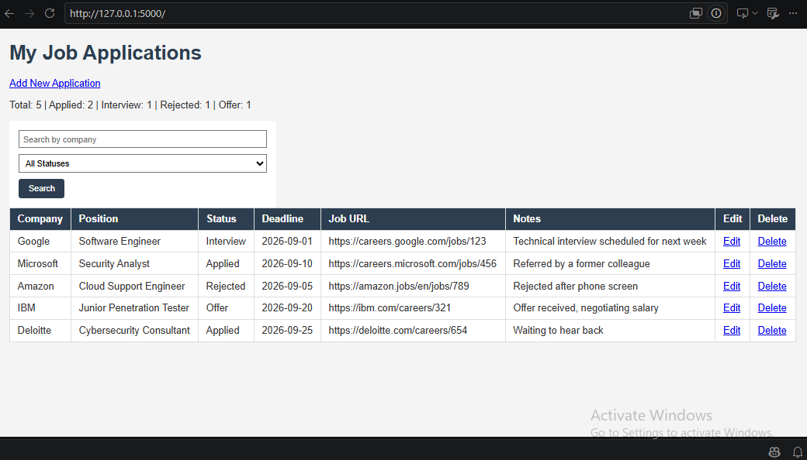
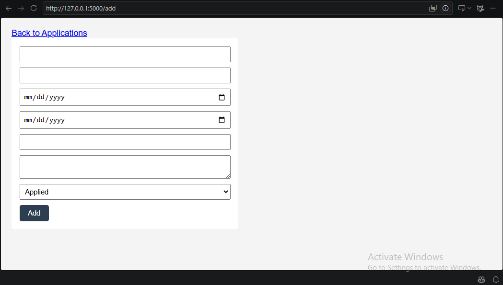
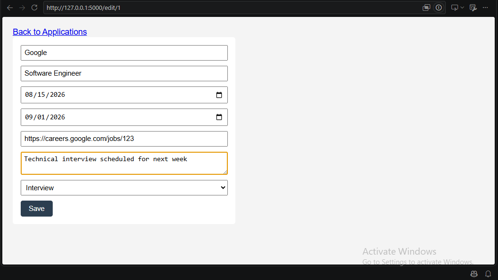

# Job Application Tracker

A web-based application for tracking job applications throughout the job search process. Built as a hands-on project to strengthen full-stack development skills while applying for cybersecurity roles. Users can log applications, track their status, search and filter through them, and see a quick statistical overview of their job search progress.

## Features

- Add new job applications with company, position, application date, deadline, status, job URL, and notes
- Edit existing applications
- Delete applications
- Search applications by company name
- Filter applications by status (Applied, Interview, Rejected, Offer)
- Dashboard showing total applications and a breakdown by status
- Server-side validation (required fields, deadline cannot precede the application date)
- Responsive, styled interface

## Tech Stack

- **Backend:** Python, Flask
- **Database:** SQLite with Flask-SQLAlchemy (ORM)
- **Frontend:** HTML, Jinja2 templates, CSS
- **Version Control:** Git & GitHub

## Screenshots

### Dashboard


### Add Application


### Edit Application


## Project Structure

```
job-tracker/
├── app.py                 # Flask routes and application logic
├── models.py               # SQLAlchemy database model
├── requirements.txt         # Python dependencies
├── static/
│   └── css/
│       └── style.css        # Application styling
├── templates/
│   ├── index.html           # Dashboard and applications table
│   ├── add.html             # Add application form
│   └── edit.html             # Edit application form
└── screenshots/             # Screenshots used in this README
```

## How to Run Locally

1. Clone the repository:
```bash
   git clone https://github.com/Sarsa-25/job-tracker.git
   cd job-tracker
```

2. Create and activate a virtual environment:
```bash
   python -m venv venv
   venv\Scripts\activate   # Windows
```

3. Install dependencies:
```bash
   pip install -r requirements.txt
```

4. Create the database:
```bash
   flask shell
```
```python
   from models import db
   db.create_all()
   exit()
```

5. Run the application:
```bash
   python app.py
```

6. Open `http://127.0.0.1:5000` in your browser.

## What I Learned

- Building a full CRUD (Create, Read, Update, Delete) web application from scratch with Flask
- Structuring a Flask project using routes, templates, and models
- Using SQLAlchemy as an ORM to define a database schema and interact with SQLite
- Handling HTML forms, including GET vs POST requests and reading form data safely
- Writing server-side validation, since client-side validation alone (like HTML's `required` or `type="url"`) can be bypassed and should never be trusted on its own
- Using Jinja2 templating to render dynamic data, including conditionals (``) and loops (``)
- Debugging real issues such as indentation errors, unreachable code after `return` statements, and Jinja2's handling of `None` values
- Using Git for incremental, meaningful commits throughout a multi-stage project

## Future Improvements

- Add user authentication so multiple users can track their own applications
- Add sorting options (e.g., by deadline or application date)
- Add pagination for large numbers of applications
- Replace raw HTML forms with client-side enhancements (e.g., better date pickers)
- Add unit tests for routes and validation logic
- Deploy the application (e.g., on Render or PythonAnywhere) so it's live and shareable
- Add duplicate-application detection as an optional warning
